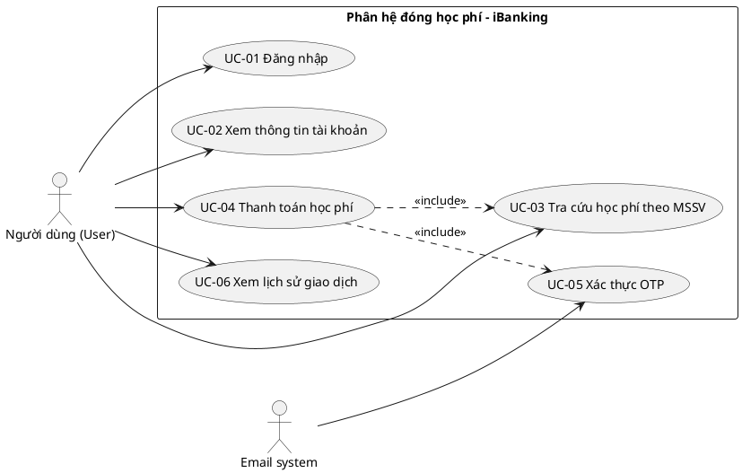
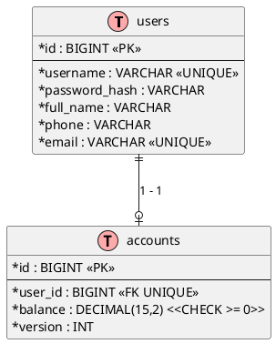

# Phase 1 — Phân tích nghiệp vụ & dữ liệu (Use Case Diagram + ERD)

**Mục tiêu:** chuyển mô tả nghiệp vụ (§1–§5 của đề) thành 2 lược đồ phân tích bắt buộc — **Use Case Diagram** và **Entity Relationship Diagram (ERD)** — kèm đặc tả chi tiết để mọi phase sau dựa vào đó.

**Đầu vào:** text đề bài (`.reasonix/ocr_text/*.txt`).

**Sản phẩm bàn giao:**
- `docs/use-case-diagram.puml` + ảnh xuất PNG + đặc tả UC (bảng dưới đây).
- `docs/erd.puml` + ảnh xuất PNG + bảng entity/constraint (dưới đây).
- Ma trận traceability yêu cầu → UC → thực thể.

> Công cụ vẽ gợi ý: **PlantUML** (file `.puml` đặt trong `docs/`) hoặc **Mermaid** trên GitHub/MkDocs. Giữ file nguồn (`.puml`) trong repo để chỉnh sửa, xuất PNG để dán vào báo cáo.

---

# PHẦN A — USE CASE DIAGRAM

## A.1. Bước 1 — Xác định Actor (tác nhân)

Đọc kỹ đề §1–§5, tìm chủ thể tương tác trực tiếp với hệ thống:

| Actor | Loại | Vai trò | Bằng chứng trong đề |
|---|---|---|---|
| **Người dùng (User)** | Primary (chính) | Đăng nhập, xem thông tin, tra cứu học phí, thanh toán cho mình **hoặc cho sinh viên khác**, nhập OTP, xem lịch sử | §1 "Một người dùng có thể thanh toán học phí cho chính mình hoặc cho sinh viên khác" |
| **Email system / Mail server** | Secondary (phụ trợ, bên ngoài) | Nhận yêu cầu gửi email OTP và email xác nhận | §3 "gửi một mã OTP qua email", §4 "Gửi email xác nhận" |

**Giải thích lựa chọn (ghi vào báo cáo):**
- **Không** có actor "Người dùng chưa đăng nhập" vì đề **không yêu cầu đăng ký tài khoản** (§1) — mọi UC đều sau đăng nhập.
- **Không** tách actor "Sinh viên": sinh viên không trực tiếp dùng hệ thống với vai trò riêng — mọi hành vi đều qua "Người dùng" (người trả tiền có thể là sinh viên hoặc người khác). Sinh viên chỉ là **dữ liệu** (tra cứu theo MSSV).
- **Hệ thống tự gửi email** (sau OTP hợp lệ) là hành vi hệ thống nội bộ → thể hiện trong đặc tả UC-04, không cần actor.

## A.2. Bước 2 — Liệt kê Use Case từ yêu cầu

Mỗi UC phải **truy vết được** về một câu trong đề. Danh sách tối thiểu:

| ID | Use Case | Nguồn trong đề | Kết quả mong đợi (khi thành công) |
|---|---|---|---|
| UC-01 | Đăng nhập | §1 "đăng nhập bằng username và password" | Có phiên/token hợp lệ; vào được chức năng thanh toán |
| UC-02 | Xem thông tin tài khoản | §1 "quản lý tối thiểu … Họ tên, SĐT, email, số dư, lịch sử" | Hiển thị hồ sơ + số dư + lịch sử giao dịch |
| UC-03 | Tra cứu học phí theo MSSV | §2 "nhập MSSV, hệ thống tra cứu và hiển thị thông tin sinh viên + số tiền học phí còn phải thanh toán" | Hiển thị tên SV + số tiền còn nợ (chỉ khoản chưa thanh toán) |
| UC-04 | Thanh toán học phí | §2 + §3 + §4 (toàn bộ luồng) | Trừ số dư, học phí = ĐÃ THANH TOÁN, có bản ghi lịch sử, có email xác nhận |
| UC-05 | Xác thực giao dịch bằng OTP | §3 "mã OTP … thời hạn tối đa 5 phút … một lần" | OTP đúng + còn hạn → giao dịch được xử lý tiếp |
| UC-06 | Xem lịch sử giao dịch | §1 "Lịch sử các giao dịch đã thực hiện", §4 "Lưu giao dịch vào lịch sử" | Danh sách giao dịch đã thực hiện của người dùng |

> Có thể thêm UC phụ trợ (tuỳ chọn, ghi rõ là optional): "Gửi lại OTP (resend)" — đề không bắt buộc, nhưng nên có để xử lý OTP hết hạn (A2).

## A.3. Bước 3 — Xác định quan hệ giữa các Use Case

Dùng đúng ký pháp UML:

| Quan hệ | Ký pháp | Áp dụng | Giải thích |
|---|---|---|---|
| `«include»` | mũi tên đứt nét, đầu mũi tên hướng về UC bị include | UC-04 → UC-03 | Thanh toán **luôn phải** tra cứu học phí trước |
| `«include»` | như trên | UC-04 → UC-05 | Thanh toán **luôn phải** qua xác thực OTP |
| `«extend»` | mũi tên đứt nét, đầu mũi tên hướng về UC bị extend, kèm điều kiện | UC "Nhập lại OTP" (extend) → UC-05 khi OTP sai/hết hạn | Luồng phụ chỉ xảy ra trong điều kiện lỗi OTP |
| Association | đường liền giữa Actor và UC | User ↔ UC-01…UC-06 | Người dùng thực hiện các UC |

**Nguyên tắc tránh sai:** `«include»` = bắt buộc chạy; `«extend»` = luồng phụ có điều kiện. Không dùng include cho UC-01 vào mọi UC khác (đăng nhập là **precondition**, ghi ở cột điều kiện tiên quyết, không vẽ include).

## A.4. Bước 4 — Vẽ Use Case Diagram

**Các bước vẽ cụ thể:**
1. Vẽ khung hệ thống (system boundary) hình chữ nhật, tiêu đề: `Phân hệ đóng học phí – iBanking`.
2. Đặt **actor** ngoài khung: `User` bên trái, `Email system` bên phải (kèm stereotype `<<actor>>` nếu dùng).
3. Đặt **6 ellipse UC** bên trong khung (tên UC + ID).
4. Vẽ **association** từ `User` tới UC-01…UC-06; từ `Email system` tới UC-05 (nếu coi việc gửi email là tương tác) — hoặc để `Email system` liên hệ với UC-04/UC-05 qua ghi chú.
5. Vẽ các mũi tên `«include»` (UC-04→UC-03, UC-04→UC-05) và `«extend»` (UC "Nhập lại OTP" → UC-05) với đúng hướng.
6. Thêm **ghi chú** (note) cho ràng buộc nghiệp vụ quan trọng: "chỉ thanh toán toàn bộ", "OTP 5 phút / 1 lần" — để người chấm thấy quy tắc được nắm bắt.

**PlantUML (mẫu để trong `docs/use-case-diagram.puml`):**

## A.5. Bước 5 — Đặc tả Use Case (quan trọng nhất: UC-04)

Viết đặc tả theo bảng chuẩn. **UC-04 là UC lõi**, cần đầy đủ nhất vì Phase 5–6 triển khai theo đúng luồng này:

| Mục | Nội dung UC-04 — Thanh toán học phí |
|---|---|
| Actor | Người dùng (đã đăng nhập) |
| Mô tả | Người dùng thanh toán **toàn bộ** khoản học phí còn nợ của một MSSV (mình hoặc người khác) bằng số dư tài khoản, sau khi xác thực OTP |
| Trigger | Người dùng bấm "Thanh toán" sau khi tra cứu MSSV thành công |
| Điều kiện tiên quyết (Precondition) | Đã đăng nhập (UC-01); MSSV tồn tại; học phí ở trạng thái UNPAID; số dư khả dụng ≥ số tiền cần thanh toán |
| Điều kiện kết thúc (Postcondition) | Số dư giảm đúng số tiền; học phí chuyển PAID; có đúng 1 bản ghi giao dịch mới trong lịch sử; email xác nhận được gửi; màn hình hiển thị kết quả thành công |
| Luồng chính (Main flow) | 1. Hệ thống hiển thị nhóm "Người nộp tiền": họ tên, SĐT, email — **lấy tự động từ tài khoản đang đăng nhập, không cho sửa** (§2) 2. Người dùng nhập MSSV 3. Hệ thống gọi tra cứu (UC-03): hiển thị họ tên sinh viên + số tiền học phí còn phải thanh toán 4. Hệ thống hiển thị nhóm "Thông tin thanh toán": số dư khả dụng, số tiền cần thanh toán, điều khoản (§2) 5. Nút "Xác nhận giao dịch" **chỉ khả dụng khi thông tin đầy đủ & hợp lệ** (§2) 6. Người dùng bấm "Xác nhận giao dịch" 7. Hệ thống tạo giao dịch mới (trạng thái chờ OTP), tạo mã OTP gắn với đúng giao dịch này và gửi qua email người nộp tiền (§3) 8. Người dùng nhập OTP nhận được 9. Hệ thống xác thực OTP: đúng giao dịch + còn hạn (≤ 5 phút) + chưa dùng lần nào (§3) 10. Hệ thống kiểm tra lại tính hợp lệ giao dịch và số dư khả dụng (§4) 11. Hệ thống trừ số tiền tương ứng khỏi tài khoản người nộp tiền (§4) 12. Hệ thống cập nhật khoản học phí tương ứng thành ĐÃ THANH TOÁN (§4) 13. Hệ thống lưu giao dịch vào lịch sử giao dịch của người dùng (§4) 14. Hệ thống gửi email xác nhận giao dịch thành công đến người nộp tiền (§4) 15. Hệ thống kết thúc giao dịch và hiển thị kết quả cho người dùng (§4) |
| Luồng thay thế (Alternate flows) | **A1 — OTP sai:** hiện lỗi "Mã OTP không đúng", cho nhập lại (giới hạn số lần, ví dụ 5 lần, sau đó khoá và yêu cầu gửi lại). **A2 — OTP hết hạn (> 5 phút):** hiện lỗi "Mã OTP đã hết hạn", cho phép gửi lại OTP mới (giao dịch cũ vẫn còn, OTP cũ vô hiệu). **A3 — Số dư không đủ (kiểm tra ở bước 10):** hiện "Số dư khả dụng không đủ", giao dịch FAILED, không trừ tiền. **A4 — Học phí đã được thanh toán (bị người khác thanh toán trước — kịch bản đồng thời §5):** hiện "Học phí đã được thanh toán", giao dịch FAILED, không trừ tiền. **A5 — MSSV không tồn tại (bước 3):** hiện "Không tìm thấy MSSV". **A6 — Học phí không tồn tại/đã thanh toán (bước 3):** hiện thông báo tương ứng, không cho thanh toán. |
| Luồng ngoại lệ (Exception) | Mất kết nối service giữa chừng → hệ thống trả lỗi chuẩn (5xx) và trạng thái giao dịch rõ ràng (PENDING/FAILED), không ghi nhận trừ tiền nếu chưa xác nhận |
| Tần suất / Ưu tiên | Trung bình (đợt đóng học phí) / Cao |
| Quy tắc nghiệp vụ (Business Rules) | **BR1:** chỉ thanh toán TOÀN BỘ khoản học phí, không thanh toán một phần (§2) **BR2:** giao dịch chỉ hợp lệ khi: học phí tồn tại + chưa thanh toán + số dư ≥ số tiền (§2) **BR3:** OTP gắn với đúng 1 giao dịch, không dùng cho giao dịch khác (§3) **BR4:** OTP hết hạn sau tối đa 5 phút (§3) **BR5:** OTP chỉ dùng thành công 1 lần (§3) **BR6:** cùng 1 học phí chỉ thanh toán thành công đúng 1 lần, kể cả khi nhiều người thanh toán đồng thời (§5) **BR7:** số dư không bao giờ âm, kể cả khi nhiều giao dịch đồng thời trên cùng tài khoản (§5) |

**Đặc tả tóm tắt các UC còn lại** (đủ để vẽ & trace, không cần dài như UC-04):

| UC | Tóm tắt luồng chính | Ngoại lệ điển hình |
|---|---|---|
| UC-01 | Nhập username/password → hệ thống kiểm tra → cấp token → vào dashboard | Sai mật khẩu → báo lỗi; (đề không yêu cầu đăng ký) |
| UC-02 | Sau đăng nhập, hệ thống hiển thị hồ sơ (họ tên, SĐT, email), số dư khả dụng và lịch sử giao dịch | Hết phiên (token hết hạn) → yêu cầu đăng nhập lại |
| UC-03 | Nhập MSSV → hiển thị họ tên SV + số tiền học phí còn phải thanh toán (chỉ khoản UNPAID) | MSSV không tồn tại; học phí đã PAID (báo "đã thanh toán", chặn UC-04) |
| UC-05 | Hệ thống tạo OTP gắn giao dịch, gửi email; người dùng nhập OTP → kiểm tra đúng + còn hạn + chưa dùng → đánh dấu dùng 1 lần → báo hợp lệ | Sai OTP, hết hạn, dùng lại OTP cũ |
| UC-06 | Hệ thống đọc lịch sử giao dịch của user hiện tại → hiển thị danh sách (thời gian, MSSV, số tiền, trạng thái) | Không có giao dịch nào → hiển thị trống |

## A.6. Bước 6 — Ma trận truy vết (Traceability) và rà soát

**Ma trận truy vết (đưa vào báo cáo):**

| Nội dung trong đề (§) | UC liên quan | Quy tắc nghiệp vụ | Thực thể liên quan (Phần B) |
|---|---|---|---|
| §1 Đăng nhập, quản lý thông tin người dùng | UC-01, UC-02, UC-06 | — | User, Account |
| §2 Nhóm thông tin màn hình thanh toán | UC-03, UC-04 | BR1, BR2 | Student, TuitionFee, Account |
| §3 OTP gắn giao dịch, 5 phút, 1 lần | UC-05 | BR3, BR4, BR5 | OtpCode, Transaction |
| §4 Xử lý giao dịch thành công | UC-04 | — | Account, TuitionFee, Transaction |
| §5 Tính nhất quán (2 kịch bản đồng thời) | UC-04 | BR6, BR7 | Account, TuitionFee, Transaction |

**Rà soát (checklist):**
- [ ] Mọi câu mô tả hành vi trong đề đều có UC hoặc BR đại diện
- [ ] Không có UC nào "vẽ cho đủ" mà không có nguồn trong đề
- [ ] Đặc tả UC-04 khớp đúng thứ tự các thao tác §2→§3→§4

---

# PHẦN B — ENTITY RELATIONSHIP DIAGRAM (ERD)

## B.1. Bước 1 — Xác định thực thể và thuộc tính

Đọc đề và liệt kê **danh từ nghiệp vụ có trạng thái/dữ liệu cần lưu**. Gợi ý cột & kiểu dữ liệu (mức logical → Phase 4 chuyển DDL):

**1. `users` (thuộc user-service) — thông tin người dùng (§1)**
| Cột | Kiểu (logical) | Ràng buộc |
|---|---|---|
| id | BIGINT / UUID | PK |
| username | VARCHAR(50) | UNIQUE, NOT NULL |
| password_hash | VARCHAR(100) | NOT NULL (bcrypt) |
| full_name | VARCHAR(100) | NOT NULL |
| phone | VARCHAR(20) | NOT NULL |
| email | VARCHAR(100) | UNIQUE, NOT NULL |
| created_at | TIMESTAMP | NOT NULL |

**2. `accounts` (thuộc user-service) — ví/số dư khả dụng (§1, §2)**
| Cột | Kiểu | Ràng buộc |
|---|---|---|
| id | BIGINT | PK |
| user_id | BIGINT | FK → users.id, UNIQUE (1 user – 1 ví) |
| balance | DECIMAL(15,2) | NOT NULL, CHECK (balance >= 0) — BR7 |
| version | INT | NOT NULL DEFAULT 0 (optimistic lock) |
| updated_at | TIMESTAMP | — |

**3. `students` (thuộc tuition-service) — sinh viên TDTU (§2)**
| Cột | Kiểu | Ràng buộc |
|---|---|---|
| id | BIGINT | PK |
| mssv | VARCHAR(20) | UNIQUE, NOT NULL |
| full_name | VARCHAR(100) | NOT NULL |
| class_name | VARCHAR(50) | (tuỳ chọn) |
| faculty | VARCHAR(100) | (tuỳ chọn) |

**4. `tuition_fees` (thuộc tuition-service) — khoản học phí (§2, §4)**
| Cột | Kiểu | Ràng buộc |
|---|---|---|
| id | BIGINT | PK |
| student_id | BIGINT | FK → students.id |
| semester | VARCHAR(20) | NOT NULL (vd "2024-2025/HK1") |
| amount | DECIMAL(15,2) | NOT NULL, CHECK (amount > 0) |
| status | VARCHAR(10) | NOT NULL, CHECK IN ('UNPAID','PAID') |
| paid_transaction_id | BIGINT | NULL — ghi giao dịch đã trả (đối chiếu chéo payment-service) |
| updated_at | TIMESTAMP | — |
| (index) | — | INDEX (student_id, status) |

**5. `transactions` (thuộc payment-service) — giao dịch/lịch sử (§1, §4)**
| Cột | Kiểu | Ràng buộc |
|---|---|---|
| id | UUID | PK |
| idempotency_key | VARCHAR(100) | UNIQUE, NOT NULL — chống trùng khi retry |
| payer_user_id | BIGINT | NOT NULL (user nộp tiền — có thể ≠ student) |
| tuition_fee_id | BIGINT | NOT NULL (FK logic tới tuition-service) |
| amount | DECIMAL(15,2) | NOT NULL, CHECK (amount > 0) — snapshot giá lúc trả |
| status | VARCHAR(20) | NOT NULL, CHECK IN ('INITIATED','OTP_SENT','OTP_VERIFIED','SUCCESS','FAILED') |
| created_at, completed_at | TIMESTAMP | — |
| (index) | — | INDEX (payer_user_id), INDEX (status) |

**6. `otp_codes` (thuộc otp-service) — mã OTP (§3)**
| Cột | Kiểu | Ràng buộc |
|---|---|---|
| id | BIGINT | PK |
| transaction_id | UUID | NOT NULL (gắn đúng 1 giao dịch — BR3) |
| code_hash | VARCHAR(100) | NOT NULL (chỉ lưu hash, không lưu plaintext) |
| expires_at | TIMESTAMP | NOT NULL (= created_at + 5 phút — BR4) |
| status | VARCHAR(10) | NOT NULL, CHECK IN ('ACTIVE','VERIFIED','EXPIRED') |
| attempts | INT | NOT NULL DEFAULT 0 (giới hạn nhập sai) |
| created_at | TIMESTAMP | — |
| (index) | — | INDEX (expires_at); UNIQUE (transaction_id) WHERE status='ACTIVE' (1 OTP hoạt động/giao dịch) |

**7. `outbox` (thuộc payment-service) — bảng trung gian phát event (Phase 2/6)**
| Cột | Kiểu | Ràng buộc |
|---|---|---|
| id | BIGINT | PK |
| event_type | VARCHAR(50) | NOT NULL |
| payload | JSONB/TEXT | NOT NULL |
| status | VARCHAR(10) | 'PENDING','SENT' |
| created_at | TIMESTAMP | — |

**8. `email_logs` (thuộc notification-service) — vết gửi email**
| Cột | Kiểu | Ràng buộc |
|---|---|---|
| id | BIGINT | PK |
| message_id | VARCHAR(100) | UNIQUE (dedupe khi nhận event lặp) |
| to_email, subject, body/template | ... | — |
| status | VARCHAR(10) | 'PENDING','SENT','FAILED' |
| attempts | INT | — |

## B.2. Bước 2 — Xác định quan hệ và bản số (cardinality)

| Quan hệ | Bản số | Giải thích |
|---|---|---|
| User – Account | 1 — 1 | Mỗi user một ví; mỗi ví thuộc một user (cột user_id UNIQUE) |
| User – Transaction | 1 — N | Một người dùng thực hiện nhiều giao dịch; mỗi giao dịch có đúng 1 người nộp (payer_user_id) |
| Student – TuitionFee | 1 — N | Một SV có thể có nhiều khoản học phí (nhiều học kỳ); mỗi khoản thuộc 1 SV |
| TuitionFee – Transaction (thành công) | 0..1 — 0..N (logic: 1 khoản được trả tối đa 1 lần) | Ràng buộc nghiệp vụ BR6: chỉ 1 giao dịch SUCCESS cho 1 fee |
| Transaction – OtpCode | 1 — 0..N | Mỗi giao dịch có thể có nhiều OTP theo thời gian (gửi lại), nhưng chỉ 1 OTP ACTIVE tại một thời điểm |

**Lưu ý cross-service:** `transactions` tham chiếu `payer_user_id` (user-service) và `tuition_fee_id` (tuition-service) bằng **FK logic** (không tạo FK vật lý xuyên database) — đây là điểm khác biệt microservices so với ERD nguyên khối, cần giải thích trong báo cáo.

## B.3. Bước 3 — Gắn ràng buộc nghiệp vụ vào ERD

| Ràng buộc | Thực thi tại | Chống lại |
|---|---|---|
| `balance >= 0` + trừ tiền có điều kiện | accounts (CHECK + conditional UPDATE) | BR7 — chi vượt số dư (Kịch bản A) |
| `status IN ('UNPAID','PAID')`, chuyển UNPAID→PAID có điều kiện | tuition_fees | BR6 — trả 2 lần (Kịch bản B) |
| `idempotency_key` UNIQUE | transactions | Retry trùng → trừ tiền 2 lần |
| OTP: `expires_at` ≤ 5 phút; UNIQUE ACTIVE/giao dịch; status 1 lần | otp_codes | BR3/BR4/BR5 |
| `amount > 0`, lưu snapshot | transactions, tuition_fees | Dữ liệu sai |

## B.4. Bước 4 — Phân rã ERD theo service (data ownership)

Mỗi service **sở hữu và chỉ truy cập** database của mình:

| Service | Bảng sở hữu | Không sở hữu (chỉ gọi API) |
|---|---|---|
| user-service | users, accounts | — |
| tuition-service | students, tuition_fees | — |
| payment-service | transactions, outbox | trạng thái fee, số dư (gọi API) |
| otp-service | otp_codes | transaction (chỉ lưu transaction_id) |
| notification-service | email_logs | — |

Vẽ **1 ERD logical tổng** (cho báo cáo, thể hiện đủ 6-8 thực thể + quan hệ) và **5 ERD vật lý nhỏ** (mỗi service một khung màu) để chỉ rõ ownership.

## B.5. Bước 5 — Các bước vẽ ERD (tóm tắt quy trình)

1. Vẽ thực thể (hình chữ nhật 2 phần: tên + danh sách thuộc tính, gạch chân PK, ký hiệu FK).
2. Vẽ quan hệ bằng đường nối với ký pháp **crow's foot** (1..N, 1..1) hoặc Chen (hình thoi) — chọn 1 ký pháp và dùng nhất quán.
3. Đánh dấu các cột ràng buộc (UNIQUE, CHECK) bằng chú thích hoặc bảng phụ.
4. Nhóm thực thể theo màu/vùng của từng service (ownership).
5. Xuất PNG + giữ file nguồn `.puml`/`.mmd`.

**PlantUML (mẫu `docs/erd.puml` — trích):**

## B.6. Bước 6 — Kiểm chứng ERD với Use Case & 2 kịch bản đồng thời

**Kiểm chứng từng UC có đủ dữ liệu:**
- [ ] UC-01: users (username/password_hash) ✓
- [ ] UC-02: users + accounts (balance) + transactions (history) ✓
- [ ] UC-03: students + tuition_fees (UNPAID) ✓
- [ ] UC-04: đủ các bảng để trừ tiền (accounts), đánh dấu trả (tuition_fees), lịch sử (transactions) ✓
- [ ] UC-05: otp_codes (transaction_id, expires_at, status, code_hash) ✓

**Kiểm chứng 2 kịch bản §5:**
- [ ] Kịch bản A (nhiều giao dịch 1 tài khoản): có cơ chế tại `accounts` (version + conditional debit + CHECK ≥ 0)
- [ ] Kịch bản B (nhiều người trả 1 học phí): có cơ chế tại `tuition_fees` (conditional UPDATE status)

**Acceptance criteria Phase 1:** Use Case Diagram + đặc tả UC-04 + ERD logical + ERD per-service đã vẽ và được kiểm chứng truy vết; sẵn sàng làm Phase 2 (kiến trúc) và Phase 4 (DDL).
