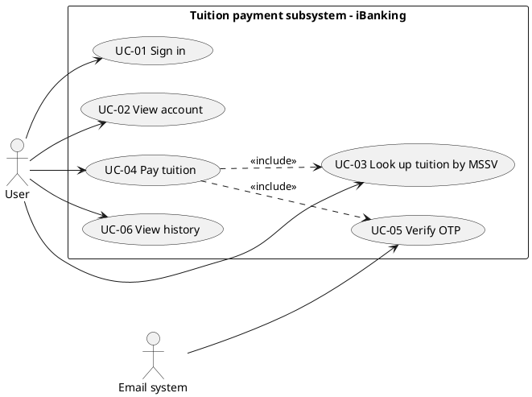

**Language:** **English** · [Tiếng Việt](01-analysis-use-case-erd.vi.md)

# Phase 1 — Business & Data Analysis (Use Case Diagram + ERD)

**Goal:** turn the assignment's business description (§1–§5) into the two required analysis artefacts — a **Use Case Diagram** and an **Entity Relationship Diagram (ERD)** — with detailed specs that every later phase builds on.

**Input:** the assignment brief.

**Deliverables:**
- `docs/use-case-diagram.puml` + exported PNG + the UC specs (table below).
- `docs/erd.puml` + exported PNG + the entity/constraint table (below).
- A requirement → UC → entity traceability matrix.

> Suggested tooling: **PlantUML** (`.puml` files under `docs/`) or **Mermaid** on GitHub/MkDocs. Keep the source `.puml` in the repo for editing, and export PNG for the report.

---

# PART A — USE CASE DIAGRAM

## A.1. Step 1 — Identify the actors

Read §1–§5 carefully and find the subjects that interact with the system directly:

| Actor | Type | Role | Evidence in the brief |
|---|---|---|---|
| **User** | Primary | Signs in, views information, looks up tuition, pays for themselves **or another student**, enters OTP, views history | §1 "a user can pay tuition for themselves or for another student" |
| **Email system / Mail server** | Secondary (external) | Receives requests to send the OTP email and the confirmation email | §3 "send an OTP by email", §4 "Send a confirmation email" |

**Rationale (for the report):**
- There is **no** "unauthenticated user" actor because the brief does **not** require account registration (§1) — every UC happens after sign-in.
- Do **not** split out a "Student" actor: a student doesn't use the system under a separate role — every action goes through the "User" (the payer may be the student or someone else). A student is only **data** (looked up by MSSV).
- **The system sending email** (after a valid OTP) is internal system behaviour → described in the UC-04 spec, no actor needed.

## A.2. Step 2 — List the use cases from the requirements

Each UC must be **traceable** to a sentence in the brief. Minimum list:

| ID | Use case | Source in the brief | Expected outcome (on success) |
|---|---|---|---|
| UC-01 | Sign in | §1 "sign in with username and password" | A valid session/token; access to the payment function |
| UC-02 | View account information | §1 "manage at least … full name, phone, email, balance, history" | Shows profile + balance + transaction history |
| UC-03 | Look up tuition by MSSV | §2 "enter the MSSV, the system looks up and displays the student info + the outstanding tuition amount" | Shows the student name + outstanding amount (UNPAID only) |
| UC-04 | Pay tuition | §2 + §3 + §4 (the whole flow) | Balance debited, fee = PAID, a history record, a confirmation email |
| UC-05 | Verify the transaction with OTP | §3 "an OTP … valid for at most 5 minutes … once" | Correct, unexpired OTP → the transaction proceeds |
| UC-06 | View transaction history | §1 "History of performed transactions", §4 "Save the transaction to history" | A list of the user's past transactions |

> You may add an optional supporting UC (mark it optional): "Resend OTP" — not required by the brief, but useful for handling an expired OTP (A2).

## A.3. Step 3 — Determine relationships between the use cases

Use proper UML notation:

| Relationship | Notation | Applied to | Explanation |
|---|---|---|---|
| `«include»` | dashed arrow pointing at the included UC | UC-04 → UC-03 | Payment **must always** look up the tuition first |
| `«include»` | as above | UC-04 → UC-05 | Payment **must always** go through OTP verification |
| `«extend»` | dashed arrow pointing at the extended UC, with a condition | UC "Re-enter OTP" (extend) → UC-05 when the OTP is wrong/expired | The extension only runs in the OTP-error condition |
| Association | solid line between actor and UC | User ↔ UC-01…UC-06 | The user performs the UCs |

**Rule of thumb:** `«include»` = always runs; `«extend»` = conditional extension. Don't include UC-01 into every UC (sign-in is a **precondition**, listed in the precondition row, not drawn as an include).

## A.4. Step 4 — Draw the use case diagram

**Concrete drawing steps:**
1. Draw the system boundary as a rectangle titled `Tuition payment subsystem – iBanking`.
2. Place the **actors** outside: `User` on the left, `Email system` on the right (with the `<<actor>>` stereotype if you like).
3. Place the **6 UC ellipses** inside (UC name + ID).
4. Draw **associations** from `User` to UC-01…UC-06; from `Email system` to UC-05 (if you treat email sending as an interaction) — or link `Email system` to UC-04/UC-05 via a note.
5. Draw the `«include»` arrows (UC-04→UC-03, UC-04→UC-05) and the `«extend»` arrow (UC "Re-enter OTP" → UC-05) in the correct direction.
6. Add **notes** for the important business rules: "whole fee only", "OTP 5 minutes / once" — so the marker sees the rules are captured.

**PlantUML (template for `docs/use-case-diagram.puml`):**

```plantuml
@startuml
left to right direction
actor "User" as U
actor "Email system" as E

rectangle "Tuition payment subsystem – iBanking" {
  usecase "UC-01 Sign in" as UC1
  usecase "UC-02 View account" as UC2
  usecase "UC-03 Look up tuition by MSSV" as UC3
  usecase "UC-04 Pay tuition" as UC4
  usecase "UC-05 Verify OTP" as UC5
  usecase "UC-06 View history" as UC6
  UC4 ..> UC3 : <<include>>
  UC4 ..> UC5 : <<include>>
}
U --> UC1
U --> UC2
U --> UC3
U --> UC4
U --> UC6
E --> UC5
@enduml
```

## A.5. Step 5 — Use case specification (most important: UC-04)

Write the spec as a standard table. **UC-04 is the core UC** and needs the most detail, because Phases 5–6 implement exactly this flow:

| Item | UC-04 — Pay tuition |
|---|---|
| Actor | User (signed in) |
| Description | The user pays the **entire** outstanding tuition fee for an MSSV (their own or another student's) from their account balance, after OTP verification |
| Trigger | The user clicks "Pay" after a successful MSSV lookup |
| Precondition | Signed in (UC-01); the MSSV exists; the fee is UNPAID; available balance ≥ the amount due |
| Postcondition | Balance debited by exactly the amount; the fee is PAID; exactly one new transaction record in the history; a confirmation email is sent; the result screen is shown |
| Main flow | 1. The system shows the "Payer" group: name, phone, email — **auto-filled from the signed-in account, read-only** (§2) 2. The user enters the MSSV 3. The system calls the lookup (UC-03): shows the student name + the outstanding tuition amount 4. The system shows the "Payment info" group: available balance, amount due, terms (§2) 5. The "Confirm transaction" button is **enabled only when the information is complete & valid** (§2) 6. The user clicks "Confirm transaction" 7. The system creates a new transaction (awaiting OTP), creates an OTP bound to exactly this transaction and emails it to the payer (§3) 8. The user enters the received OTP 9. The system verifies the OTP: correct transaction + unexpired (≤ 5 minutes) + unused (§3) 10. The system re-checks the transaction validity and the available balance (§4) 11. The system debits the amount from the payer's account (§4) 12. The system marks the tuition fee as PAID (§4) 13. The system saves the transaction to the user's history (§4) 14. The system sends a confirmation email to the payer (§4) 15. The system ends the transaction and shows the result to the user (§4) |
| Alternate flows | **A1 — wrong OTP:** show "Incorrect OTP", allow re-entry (limited attempts, e.g. 5, then lock and require a resend). **A2 — expired OTP (> 5 min):** show "OTP expired", allow a new OTP (the transaction remains; the old OTP is invalidated). **A3 — insufficient balance (checked at step 10):** show "Insufficient balance", transaction FAILED, no debit. **A4 — fee already paid (paid by someone else first — concurrency scenario §5):** show "Tuition already paid", transaction FAILED, no debit. **A5 — MSSV does not exist (step 3):** show "MSSV not found". **A6 — fee missing/already paid (step 3):** show the appropriate message, block payment. |
| Exception flow | A mid-flow service outage → the system returns a standard error (5xx) and a clear transaction state (PENDING/FAILED); no debit is recorded unless confirmed |
| Frequency / priority | Medium (during the tuition drive) / High |
| Business rules | **BR1:** pay the WHOLE fee only, no partial payment (§2) **BR2:** a transaction is valid only when: the fee exists + is unpaid + balance ≥ amount (§2) **BR3:** the OTP is bound to exactly one transaction, not usable for another (§3) **BR4:** the OTP expires after at most 5 minutes (§3) **BR5:** the OTP succeeds only once (§3) **BR6:** the same fee succeeds exactly once even under concurrent payers (§5) **BR7:** the balance is never negative even under concurrent transactions on one account (§5) |

**Summary specs for the remaining UCs** (enough to draw & trace; they don't need UC-04's length):

| UC | Main-flow summary | Typical exceptions |
|---|---|---|
| UC-01 | Enter username/password → the system checks → issues a token → opens the dashboard | Wrong password → error; (no registration required) |
| UC-02 | After sign-in the system shows the profile (name, phone, email), available balance and transaction history | Session expired → require sign-in again |
| UC-03 | Enter the MSSV → show the student name + the outstanding amount (UNPAID only) | MSSV not found; fee already PAID (report "already paid", block UC-04) |
| UC-05 | The system creates a transaction-bound OTP, emails it; the user enters the OTP → check correct + unexpired + unused → mark used once → report valid | Wrong OTP, expired, reused |
| UC-06 | The system reads the current user's history → shows the list (time, MSSV, amount, status) | No transactions → show empty |

## A.6. Step 6 — Traceability matrix & review

**Traceability matrix (for the report):**

| Item in the brief (§) | Related UCs | Business rules | Related entities (Part B) |
|---|---|---|---|
| §1 Sign-in, user-info management | UC-01, UC-02, UC-06 | — | User, Account |
| §2 Payment-screen info groups | UC-03, UC-04 | BR1, BR2 | Student, TuitionFee, Account |
| §3 Transaction-bound OTP, 5 minutes, once | UC-05 | BR3, BR4, BR5 | OtpCode, Transaction |
| §4 Successful transaction handling | UC-04 | — | Account, TuitionFee, Transaction |
| §5 Consistency (two concurrency scenarios) | UC-04 | BR6, BR7 | Account, TuitionFee, Transaction |

**Review checklist:**
- [ ] Every behavioural sentence in the brief has a representing UC or BR
- [ ] No UC is "drawn for completeness" without a source in the brief
- [ ] The UC-04 spec matches the §2→§3→§4 order of operations

---

# PART B — ENTITY RELATIONSHIP DIAGRAM (ERD)

## B.1. Step 1 — Identify entities and attributes

Read the brief and list the **business nouns with state/data worth storing**. Suggested columns & types (logical level → Phase 4 turns them into DDL):

**1. `users` (owned by user-service) — user information (§1)**
| Column | Type (logical) | Constraints |
|---|---|---|
| id | BIGINT / UUID | PK |
| username | VARCHAR(50) | UNIQUE, NOT NULL |
| password_hash | VARCHAR(100) | NOT NULL (bcrypt) |
| full_name | VARCHAR(100) | NOT NULL |
| phone | VARCHAR(20) | NOT NULL |
| email | VARCHAR(100) | UNIQUE, NOT NULL |
| created_at | TIMESTAMP | NOT NULL |

**2. `accounts` (owned by user-service) — wallet/available balance (§1, §2)**
| Column | Type | Constraints |
|---|---|---|
| id | BIGINT | PK |
| user_id | BIGINT | FK → users.id, UNIQUE (1 user – 1 wallet) |
| balance | DECIMAL(15,2) | NOT NULL, CHECK (balance >= 0) — BR7 |
| version | INT | NOT NULL DEFAULT 0 (optimistic lock) |
| updated_at | TIMESTAMP | — |

**3. `students` (owned by tuition-service) — TDTU students (§2)**
| Column | Type | Constraints |
|---|---|---|
| id | BIGINT | PK |
| mssv | VARCHAR(20) | UNIQUE, NOT NULL |
| full_name | VARCHAR(100) | NOT NULL |
| class_name | VARCHAR(50) | (optional) |
| faculty | VARCHAR(100) | (optional) |

**4. `tuition_fees` (owned by tuition-service) — tuition fee (§2, §4)**
| Column | Type | Constraints |
|---|---|---|
| id | BIGINT | PK |
| student_id | BIGINT | FK → students.id |
| semester | VARCHAR(20) | NOT NULL (e.g. "2024-2025/HK1") |
| amount | DECIMAL(15,2) | NOT NULL, CHECK (amount > 0) |
| status | VARCHAR(10) | NOT NULL, CHECK IN ('UNPAID','PAID') |
| paid_transaction_id | BIGINT | NULL — records the paying transaction (cross-check with payment-service) |
| updated_at | TIMESTAMP | — |
| (index) | — | INDEX (student_id, status) |

**5. `transactions` (owned by payment-service) — transaction/history (§1, §4)**
| Column | Type | Constraints |
|---|---|---|
| id | UUID | PK |
| idempotency_key | VARCHAR(100) | UNIQUE, NOT NULL — dedupes retries |
| payer_user_id | BIGINT | NOT NULL (payer — may ≠ student) |
| tuition_fee_id | BIGINT | NOT NULL (logical FK to tuition-service) |
| amount | DECIMAL(15,2) | NOT NULL, CHECK (amount > 0) — price snapshot at payment time |
| status | VARCHAR(20) | NOT NULL, CHECK IN ('INITIATED','OTP_SENT','OTP_VERIFIED','SUCCESS','FAILED') |
| created_at, completed_at | TIMESTAMP | — |
| (index) | — | INDEX (payer_user_id), INDEX (status) |

**6. `otp_codes` (owned by otp-service) — OTP code (§3)**
| Column | Type | Constraints |
|---|---|---|
| id | BIGINT | PK |
| transaction_id | UUID | NOT NULL (bound to exactly 1 transaction — BR3) |
| code_hash | VARCHAR(100) | NOT NULL (hash only, no plaintext) |
| expires_at | TIMESTAMP | NOT NULL (= created_at + 5 minutes — BR4) |
| status | VARCHAR(10) | NOT NULL, CHECK IN ('ACTIVE','VERIFIED','EXPIRED') |
| attempts | INT | NOT NULL DEFAULT 0 (failed-attempt limit) |
| created_at | TIMESTAMP | — |
| (index) | — | INDEX (expires_at); UNIQUE (transaction_id) WHERE status='ACTIVE' (1 active OTP per transaction) |

**7. `outbox` (owned by payment-service) — event-publishing relay table (Phase 2/6)**
| Column | Type | Constraints |
|---|---|---|
| id | BIGINT | PK |
| event_type | VARCHAR(50) | NOT NULL |
| payload | JSONB/TEXT | NOT NULL |
| status | VARCHAR(10) | 'PENDING','SENT' |
| created_at | TIMESTAMP | — |

**8. `email_logs` (owned by notification-service) — email-sending trace**
| Column | Type | Constraints |
|---|---|---|
| id | BIGINT | PK |
| message_id | VARCHAR(100) | UNIQUE (dedupe on repeated events) |
| to_email, subject, body/template | … | — |
| status | VARCHAR(10) | 'PENDING','SENT','FAILED' |
| attempts | INT | — |

## B.2. Step 2 — Determine relationships and cardinality

| Relationship | Cardinality | Explanation |
|---|---|---|
| User – Account | 1 — 1 | Each user has one wallet; each wallet belongs to one user (user_id UNIQUE) |
| User – Transaction | 1 — N | One user makes many transactions; each transaction has exactly one payer (payer_user_id) |
| Student – TuitionFee | 1 — N | A student can have many tuition fees (many semesters); each fee belongs to one student |
| TuitionFee – Transaction (successful) | 0..1 — 0..N (logical: a fee is paid at most once) | Business rule BR6: only one SUCCESS transaction per fee |
| Transaction – OtpCode | 1 — 0..N | A transaction can have many OTPs over time (resends), but only one ACTIVE OTP at a time |

**Cross-service note:** `transactions` references `payer_user_id` (user-service) and `tuition_fee_id` (tuition-service) with **logical FKs** (no physical cross-database FK) — this is the microservices difference from a monolith ERD and should be explained in the report.

## B.3. Step 3 — Attach business rules to the ERD

| Rule | Enforced at | Guards against |
|---|---|---|
| `balance >= 0` + conditional debit | accounts (CHECK + conditional UPDATE) | BR7 — overspending (Scenario A) |
| `status IN ('UNPAID','PAID')`, conditional UNPAID→PAID | tuition_fees | BR6 — double payment (Scenario B) |
| `idempotency_key` UNIQUE | transactions | Duplicate retry → double debit |
| OTP: `expires_at` ≤ 5 minutes; UNIQUE ACTIVE/transaction; one-time status | otp_codes | BR3/BR4/BR5 |
| `amount > 0`, snapshot stored | transactions, tuition_fees | Bad data |

## B.4. Step 4 — Decompose the ERD per service (data ownership)

Each service **owns and only accesses** its own database:

| Service | Owns | Does not own (calls the API) |
|---|---|---|
| user-service | users, accounts | — |
| tuition-service | students, tuition_fees | — |
| payment-service | transactions, outbox | fee status, balance (via API) |
| otp-service | otp_codes | transaction (stores only transaction_id) |
| notification-service | email_logs | — |

Draw **one overall logical ERD** (for the report, showing the 6–8 entities + relationships) and **5 small physical ERDs** (one coloured box per service) to make ownership explicit.

## B.5. Step 5 — Drawing steps (process summary)

1. Start from the entity/attribute tables above and draw each entity as a box with its columns.
2. Add the relationships with crow's-foot cardinality.
3. Colour-group the boxes by owning service.
4. Mark logical (cross-service) references with a dashed line and a comment noting "logical FK, no physical FK".
5. Export the PNG and attach the source `.puml` for the report.
