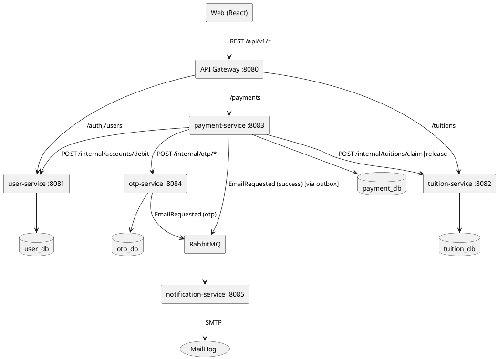

# Phase 2 — Thiết kế kiến trúc Microservices

**Mục tiêu:** xác định **các service**, **trách nhiệm của từng service** và **cách thức giao tiếp giữa các service** (đáp ứng yêu cầu 2 của đề), trình bày bằng **Microservices Architecture Diagram**.

**Đầu vào:** Phase 1 (UC-04 là luồng lõi; ERD đã phân ownership).

**Sản phẩm bàn giao:** bảng service + bản đồ giao tiếp (2 phần) + sơ đồ kiến trúc (file nguồn + PNG) + bảng routing gateway.

---

## 2.1. Nguyên tắc phân rã service (giải thích trong báo cáo)

Phân rã dựa trên 3 tiêu chí:
1. **Bounded context / tách biệt miền dữ liệu:** mỗi service sở hữu trọn vẹn một nhóm thực thể và **không dùng chung database**.
2. **Transactional boundary (biên giao dịch):** nghiệp vụ "trừ tiền" và "đánh dấu học phí đã trả" nằm ở **2 nơi sở hữu dữ liệu khác nhau** → bắt buộc có cơ chế phối hợp (saga) → đây là lý do thiết kế payment-service làm điều phối (Phase 6).
3. **Tần suất thay đổi & lý do tồn tại riêng:** OTP có vòng đời và ràng buộc bảo mật riêng; email là tác vụ phụ trợ chậm nên tách để không chặn luồng chính.

## 2.2. Danh sách service, trách nhiệm và dữ liệu sở hữu

| # | Service | Trách nhiệm (responsibility) | Sở hữu dữ liệu | Nghiệp vụ lõi phải làm đúng |
|---|---|---|---|---|
| 0 | **gateway** (Spring Cloud Gateway) | Cổng vào duy nhất: routing theo path, kiểm tra JWT, CORS, rate-limit, chuyển lỗi về dạng chuẩn | không có | Chặn request chưa xác thực (401) |
| 1 | **user-service** | Quản lý danh tính + ví: đăng nhập (username/password → JWT), đọc hồ sơ, xem số dư, **trừ tiền nguyên tử** | `users`, `accounts` | **Debit không bao giờ làm âm số dư** (BR7) |
| 2 | **tuition-service** | Quản lý sinh viên + học phí: tra cứu theo MSSV, trả về khoản UNPAID, **claim/đánh dấu đã trả có điều kiện** | `students`, `tuition_fees` | **1 fee chỉ được trả 1 lần** (BR6) |
| 3 | **payment-service** | Điều phối toàn bộ luồng thanh toán (saga orchestrator): tạo giao dịch, phối hợp OTP, xác nhận, gọi trừ tiền + claim fee, ghi lịch sử, phát event | `transactions`, `outbox` | Đúng state machine; retry không trùng; có bù trừ khi lỗi |
| 4 | **otp-service** | Vòng đời OTP: sinh mã, lưu hash, hạn 5 phút, dùng 1 lần, xác thực, yêu cầu gửi email | `otp_codes` | BR3/BR4/BR5 (đúng giao dịch, hết hạn, 1 lần) |
| 5 | **notification-service** | Nhận event từ queue → gửi email (OTP, xác nhận thành công) qua SMTP; retry + dedupe | `email_logs` | Không gửi trùng email khi event lặp |
| — | **web (React)** | Giao diện người dùng, chỉ gọi gateway | — | — |

**Vì sao không gộp/tách thêm (ghi vào báo cáo để chứng minh hiểu biết):**
- **Không gộp otp vào payment:** OTP có ràng buộc thời gian thực & bảo mật riêng, muốn scale/thay đổi độc lập; tách ra cũng minh hoạ được giao tiếp service→service.
- **Không gộp notification vào otp:** email còn phục vụ "xác nhận thành công" (§4) — là tác vụ chậm, không được nằm trong đường giao dịch chính.
- **Không tách "auth-service" riêng:** quy mô đề bài nhỏ, đăng nhập gắn với dữ liệu user; tách thêm chỉ tăng độ phức tạp không cần thiết.
- **Không gộp payment vào user/tuition:** làm vậy sẽ tạo shared database giữa "ví" và "học phí", phá vỡ bounded context; đúng tinh thần microservices là để chúng riêng và phối hợp bằng saga.

## 2.3. Cách thức giao tiếp giữa các service — CÓ 2 PHẦN

### PHẦN A — Giao tiếp ĐỒNG BỘ (Synchronous): HTTP/REST (JSON)

Dùng khi caller **cần câu trả lời ngay** để quyết định bước tiếp theo (query hoặc command ngắn).

**Bản đồ các cuộc gọi đồng bộ:**

| # | Caller → Callee | Endpoint (thiết kế chi tiết ở Phase 3) | Mục đích |
|---|---|---|---|
| 1 | web → gateway | toàn bộ `/api/v1/**` | Mọi request UI đi qua gateway |
| 2 | gateway → user-service | `POST /api/v1/auth/login` | Đăng nhập, cấp JWT |
| 3 | gateway → user-service | `GET /api/v1/users/me`, `GET /api/v1/users/me/accounts` | Hồ sơ + số dư |
| 4 | gateway → tuition-service | `GET /api/v1/tuitions?mssv=...` | Tra cứu học phí cho UI |
| 5 | gateway → payment-service | `POST /api/v1/payments`, `POST /api/v1/payments/{id}/confirm`, `GET /api/v1/payments/me` | Luồng thanh toán + lịch sử |
| 6 | payment-service → tuition-service | `POST /internal/tuitions/claim` | Claim fee (chỉ thành công nếu UNPAID) |
| 7 | payment-service → user-service | `POST /internal/accounts/debit` | Trừ tiền nguyên tử (kèm Idempotency-Key) |
| 8 | payment-service → tuition-service | `POST /internal/tuitions/{feeId}/release` | Bù trừ (compensation) khi debit thất bại |
| 9 | payment-service → otp-service | `POST /internal/otp/issue`, `POST /internal/otp/verify` | Sinh/xác thực OTP |
| 10 | otp-service → (queue) | — | Xem PHẦN B |

**Kỷ luật bắt buộc cho PHẦN A (ghi rõ trong code guideline):**
1. **Timeout** mỗi call (vd 3s connect + 5s read) — không để chuỗi call treo.
2. **Retry an toàn:** chỉ retry khi lỗi tạm thời (network, 503); mọi command có `Idempotency-Key` để retry không gây trùng.
3. **Circuit breaker** cho service phụ thuộc (dùng Resilience4j nếu là Spring) — khi user-service/otp-service ngã, payment-service trả lỗi nhanh thay vì chờ.
4. **Mã lỗi chuẩn:** 4xx = lỗi nghiệp vụ của caller; 5xx/503 = dependency lỗi → payment-service map thành trạng thái giao dịch FAILED/rõ ràng.

### PHẦN B — Giao tiếp BẤT ĐỒNG BỘ (Asynchronous): Message queue / Event (RabbitMQ)

Dùng cho **tác vụ phụ trợ không được nằm trong giao dịch chính** — caller gửi xong tiếp tục, không chờ.

**Các event/queue:**

| Event | Producer | Consumer | Queue / Exchange | Payload ví dụ |
|---|---|---|---|---|
| `EmailRequested` | otp-service (khi sinh OTP) | notification-service | exchange `email.exchange`, routing key `email.send` | `{ to, template: "otp", data: { otp } }` |
| `EmailRequested` | payment-service (sau SUCCESS) | notification-service | như trên | `{ to, template: "payment-success", data: { txnId, amount } }` |

**Kỷ luật bắt buộc cho PHẦN B:**
1. **Outbox pattern:** payment-service/otp-service không publish trực tiếp giữa giao dịch DB; thay vào đó **ghi event vào bảng `outbox` trong cùng transaction**, sau đó một relay đọc outbox và publish lên RabbitMQ (at-least-once). → đảm bảo "không mất event khi crash giữa chừng".
2. **Consumer idempotent:** notification-service dedupe bằng `message_id` (cột UNIQUE trong `email_logs`) vì at-least-once có thể gửi lặp.
3. **Retry + Dead Letter Queue:** consumer thất bại → requeue vài lần có backoff → quá số lần chuyển DLQ để xử lý thủ công.

> **Tóm tắt cho báo cáo — "cách thức giao tiếp giữa các service có mấy phần?":** có **2 phần**: (A) **đồng bộ — request/response qua REST/HTTP** cho các bước cần kết quả tức thời; (B) **bất đồng bộ — messaging/event qua RabbitMQ** cho các tác vụ phụ trợ (gửi email), kết hợp outbox để đảm bảo nhất quán. API Gateway là điểm vào biên, không phải phần giao tiếp thứ 3.

## 2.4. Cơ chế đảm bảo toàn vẹn dữ liệu giữa các service (nền tảng Phase 6)

**Vấn đề:** luồng UC-04 chạm dữ liệu của 3 service (trừ tiền ở user, đánh dấu trả ở tuition, ghi lịch sử ở payment) → không thể dùng 1 transaction DB duy nhất.

**Giải pháp — Saga do payment-service điều phối (orchestration):**

```
POST /payments/{id}/confirm  (OTP hợp lệ)
  1. Re-check: fee UNPAID, balance đủ          [payment đọc qua API]
  2. claimFee(feeId)  → tuition-service         [conditional UPDATE → fee = CLAIMED/giữ UNPAID nhưng khoá]
  3. debit(accountId, amount, idemKey) → user-service
       ├─ thành công → 4
       └─ thất bại  → COMPENSATE: releaseFee(feeId) → transaction FAILED → kết thúc
  4. đánh dấu fee PAID (hoàn tất claim) → tuition-service
  5. transaction = SUCCESS; ghi outbox Event TransactionSucceeded
  6. relay outbox → RabbitMQ → notification-service gửi email xác nhận
```

**Trạng thái (state machine) của `transactions` (payment-service):**
`INITIATED → OTP_SENT → OTP_VERIFIED → SUCCESS`; từ bất kỳ bước nào lỗi → `FAILED`. Mọi chuyển trạng thái ghi log kèm lý do.

**Các nguyên tắc concurrency (chi tiết Phase 6):**
- Trừ tiền: 1 câu `UPDATE accounts SET balance=balance-:amt, version=version+1 WHERE id=:id AND balance>=:amt` — trả về 0 dòng = từ chối.
- Claim fee: `UPDATE tuition_fees SET status='PAID', paid_transaction_id=:txn WHERE id=:id AND status='UNPAID'` — trả về 0 dòng = fee đã bị trả (Kịch bản B).
- Mọi command xuyên service đều kèm `Idempotency-Key`.

## 2.5. Microservices Architecture Diagram (bắt buộc — yêu cầu 2)

**Các thành phần vẽ:** web (browser) → gateway → 5 service; mỗi service kèm database riêng (Postgres + Redis chung cho OTP/rate-limit); RabbitMQ ở giữa; MailHog bên cạnh notification-service. Ghi chú arrows.

**Mô tả văn bản (dùng để vẽ):**
```
[Browser/Web] --REST--> [API Gateway :8080]
[Gateway] --REST--> [user-service :8081] --DB--> (user_db)
[Gateway] --REST--> [tuition-service :8082] --DB--> (tuition_db)
[Gateway] --REST--> [payment-service :8083] --DB--> (payment_db: transactions, outbox)
[payment-service] --REST--> [user-service]      (debit)
[payment-service] --REST--> [tuition-service]   (claim/release)
[payment-service] --REST--> [otp-service :8084] (issue/verify)
[otp-service] --DB--> (otp_db)
[otp-service] --Event(EmailRequested)--> [RabbitMQ] --> [notification-service :8085] --DB--> (notification_db) --SMTP--> (MailHog)
[payment-service] --outbox relay--> [RabbitMQ] --> [notification-service]
[otp-service] --Redis--> (OTP TTL / rate limit)     [user-service] --Redis--> (idempotency, lock)
```

**PlantUML (mẫu `docs/architecture.puml`):**


**Bảng routing gateway:**

| Path prefix | Forward tới | Ghi chú |
|---|---|---|
| `/api/v1/auth/**` | user-service:8081 | public (đăng nhập) |
| `/api/v1/users/**` | user-service:8081 | cần JWT |
| `/api/v1/tuitions/**` | tuition-service:8082 | cần JWT |
| `/api/v1/payments/**` | payment-service:8083 | cần JWT |
| `/internal/**` | **KHÔNG route** — chặn ở gateway | chỉ service gọi trực tiếp bằng service token/nội bộ |

**Danh sách kiểm tra hoàn thành Phase 2:**
- [ ] Bảng service + trách nhiệm + ownership hoàn chỉnh (2.2)
- [ ] Giải thích được vì sao có đúng 2 phần giao tiếp và mapping từng luồng (2.3)
- [ ] Sơ đồ kiến trúc vẽ đủ 6 thành phần + arrows REST/event + database riêng (2.5)
- [ ] State machine transaction + saga + compensation được mô tả (2.4)

**Acceptance criteria:** một người chưa đọc đề có thể hiểu **ai sở hữu dữ liệu gì, gọi ai bằng gì** chỉ từ sơ đồ + bảng 2.2/2.3; sơ đồ phù hợp để dán vào báo cáo (yêu cầu 2).
